# Machine Learning deployment pipeline on Google Cloud Run

_João Araujo, May 04, 2020_

This project is a simple example on how to deploy your Machine Learning algorithm on Google Cloud in a Continuous Integration and Deployment (CI/CD) context. For this, I understand that you'll need to have this skills:

- Python: <span style='color:darkorange'>`Intermediate`</span>
- Flask: <span style='color:green'>`Basic`</span>
- Terminal: <span style='color:darkorange'>`Intermediate`</span>
- Docker: <span style='color:green'>`Basic`</span>
- Cloud: <span style='color:green'>`Basic`</span>

## TL; TR;

I configured a pipeline to deploy Machine Learning models on Google Cloud Platform (GCP) that starts with a `git push` in a GitHub repository and ends with a [Google Cloud Run](https://cloud.google.com/run) service running my application. Basically, the pipeline is as follows:

```
Local Repo > 
  Remote GitHub Repo >
    Google Cloud Build (trigger/image builder) >
      Google Container Registry > 
        Google Cloud Run
```
I followed some best practices to build my application in a way that the (re)building process is more efficient, like Dockerfile structure and caching images.

The technologies used to make the model application was:

- Python: `as language` 
- scikit-learn: `dataset & model`
- Pickle: `model object serialization`
- Flask: `as web framework`
- Docker: `for image/container creation`

## Project tree

```
ml-deployment-on-gcloud/
├── README.md
├── cloudbuild.yaml
├── Dockerfile
├── requirements.txt
├── train
│   ├── boston_problem.py
│   ├── example.json
│   └── ml-model.pkl
├── app_files
│   ├── app.py
│   └── ml-model.pkl
├── request_test
│   ├── loop_get.py
│   ├── loop_post.py
│   └── example.json
├── gcp_commands
│   ├── gcloud_config.sh
│   └── install_gcloud_sdk.sh
├── (+) screenshots
└── LICENSE

5 directories, 23 files
```

## Before you go through the article

Please, activate Google Container Registry, Cloud Build and Cloud Run APIs.

In folder `gcp_commands` have two shell script files. One to install Google Cloud SDK into Ubuntu, `install_gcloud_sdk.sh`, and the other to initialize the `gcloud` and configure the necessary IAM policies to the CI/CD pipeline, `gcloud_config.sh`. I recommend you to read and run this two scripts before you go through the article.

## Toy problem & the model entity

In this tutorial, I used the scikit-learn [Boston data set](https://scikit-learn.org/stable/datasets/index.html#boston-house-prices-dataset) to create my ML model. It is a regression of a continuous target variable, namely, price. To make it even simpler, I trained a [Linear Regression](https://scikit-learn.org/stable/modules/generated/sklearn.linear_model.LinearRegression.html) model that also belongs to the scikit-learn package, but I could choose any other model (XGBoost, LightGBM, ...).

The folder named `train` contains a Python file, `boston_problem.py`, that loads the dataset, saves a JSON file (`example.json`) for test and saves the scikit-learn model object into a Pickle file (`ml-model.pkl`). Here is the most important part of the code: 

 ```python
X.sample(1, random_state=0).iloc[0].to_json('example.json')
model = LinearRegression()
model.fit(X, y)
with open('ml-model.pkl', 'wb') as f:
    pickle.dump(model, f)
 ```

This is a very simple example of how to train a model and make it portable through the Pickle package object serialization. Whatever you go &mdash; for cloud or other computers &mdash;, if you have the same scikit-learn and Python version, you will load this Pickle file and get the same object of when it was saved.

Notice that in the `boston_problem.py` I put a command that prints the columns of my dataset. It's important because the order of columns matter in almost every algorithm of ML. I used the output of this command in my Flask application to eliminate possible mistakes.

## Flask application

Flask is a micro web framework written in Python. This API helped me to create an application that execute my model prediction function in a web address in the *localhost*. It's very simple, you only need to know three commands to expose your functions.

If you don't know anything about Flask, I recommend you to read the Todd Birchard articles [[1]](#L1).

The `app_files` folder contains two files: `ml-model.pkl`, the object that contains my exact created and trained model; and`app.py`, the application itself.

In `app.py` I read the `.pkl` using the Pickle package:

```python
with open('ml-model.pkl', 'rb') as f:
    MODEL = pickle.load(f)
```

After that, I created a variable that I named `app` and it's a Flask object. This object has a [decorator](https://www.datacamp.com/community/tutorials/decorators-python) called `route` that exposes my functions to the web framework in a given URL pattern, e.g., _myapp.com:8080_**/** and _myapp.com:8080_**/predict** has `"/"` and `"/predict"` as routes, respectively. This decorator gives the option to choose the request method of this route. There are two main methods that can be simply described as follows:

- GET: to retrieve an information (message);
- POST: to receive an information and return the task result (another information/message);

I created one function for each method. The first is a message to know that the application is alive:

```python
@app.route('/', methods=['GET'])
def server_check():
    return "I'M ALIVE!"
```

And the second is my model prediction function:

```python
@app.route('/predict', methods=['POST'])
def predictor():
    content = request.json
    # <...>
```

Remember that I said that for almost every algorithm the column order is important? I made a `try`/`except` to guarantee that:

```python
    try:
        features = pd.DataFrame([content])
        features = features[FEATURES_MASK]
    except:
        logging.exception("The JSON file was broke.")
        return jsonify(status='error', predict=-1)
```

The last two command lines of the `app.py` file runs the application into the IP `0.0.0.0` (localhost) and, if the system has no environment variable named `PORT`, in port `8080`. This environment variable `PORT` is important to deploy on Google Cloud.

```python
if __name__=='__main__':
    app.run( debug=True, host='0.0.0.0', port=int(os.environ.get('PORT', 8080)) )
```

The conditional statement `__name__=='__main__'` is because I just want to run my application if I am executing the file `app.py`. 

## Request tests

In folder `request_test` I have two Python files to each request method that makes infinity loops. I used this programs to test my local and cloud Flask applications. To test the afore mentioned Flask application, all you have to do is run `app.py` with Python and run `loop_get.py` or `loop_post.py`.

Below, I put an example of the output. As you will see the response time is around 3ms-4ms.

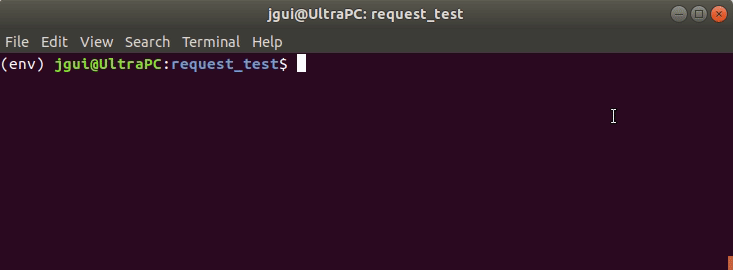

## Docker & Dockerfile

Docker is an excellent container image manager and did the system isolation work for me. I just made a simple Dockerfile, but I have two tips for you:

- If your application don't need a whole operating system, you can get small base image to you application. Instead of `ubuntu:18.04` you can choose `python:3.6`; instead of `python:3.6` you can choose `python:3.6-slim-buster`; and so on.
- A container image is built of layers. Every command is a layer. If something change in the command (the content of a file, the command itself, ...) the layer changes. The tip here is to use cache images, i.e., to use a pre-built image and it's layers in the process of building a new image. For this, put the commands and layers more prone to change in the end of the file. The classical layer to put in the first lines is the one to install dependencies. This dependencies are explicitly declared in `requirements.txt`.

This is my Dockerfile:

```dockerfile
# a small operating system
FROM python:3.6-slim-buster
# layers to install dependencies (less prone to changes)
RUN python -m pip install --upgrade pip
COPY requirements.txt .
RUN pip install -r requirements.txt
# layers to copy my files (more prone to changes)
COPY . /app
WORKDIR /app/app_files
# starts my application
CMD ["python", "app.py"]
```

NOTE: I lost sometime to understand the difference between commands RUN, CMD and ENTRYPOINT. If you wanna know this too, I recommend you to read Yury Pitsishin's article [[2]](#L2).

## Git Repo

Until here, I had a complete containerized application working in my local host. To expose my model as a service on the cloud, I had to make it accessible. So, for this deployment example I choose to store my files on GitHub, one of the possible repositories that Google Cloud Build accepts to do a Continuous Integration. 

## Google Cloud Build - The trigger

[Google Cloud Build](https://console.cloud.google.com/cloud-build/triggers) is a repository listener that can do almost everything you want after a `git push` command execution. It understands that some commit was made and trigger the execution of a script contained in a YAML file that belongs to the same repository. I'll talk about this file in the next section. For now, I'll show you how to configure this trigger.

### Step 1: Choose your repo


Google Cloud has its own repository, the Google Cloud Source Repositories. However, in this project I choose GitHub, because I'm using a trial account. If you use the Google Cloud repo, go to step 5.

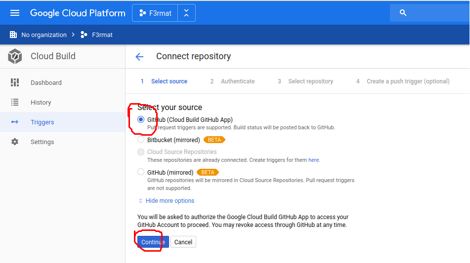

### Step 2: Install Google Cloud Build app in you GitHub account

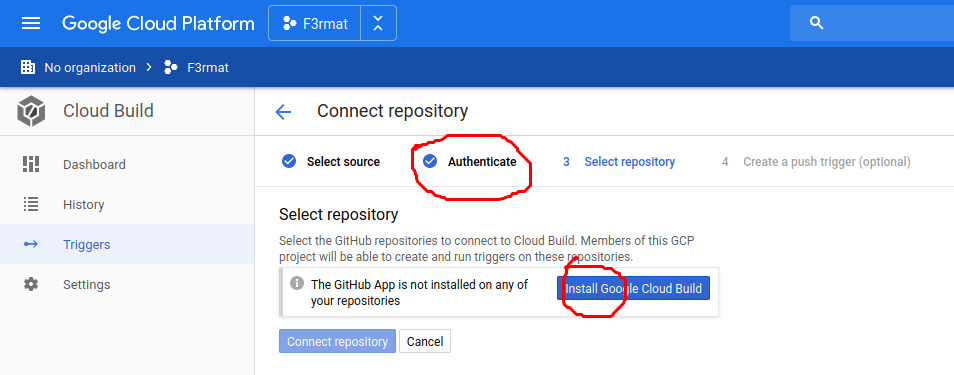

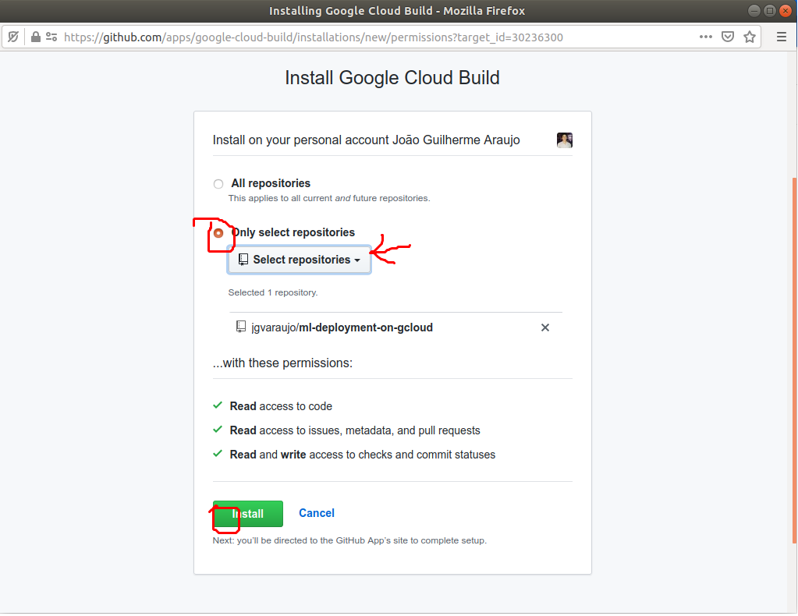

### Step 3: Select the repositories you want to listen

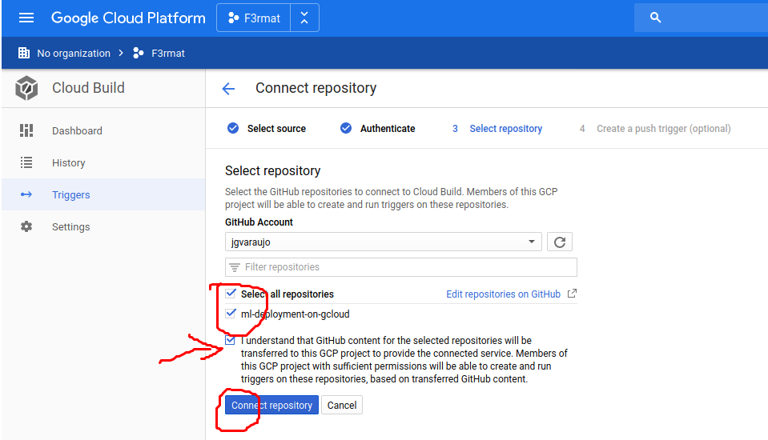

### Step 4: Create the Push Trigger

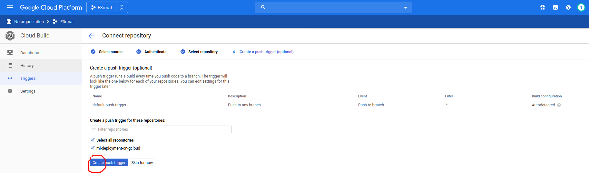

### Step 5: Edit the trigger to change the name, choose trigger branches and select the build configuration file (`cloudbuild.yaml`) ###################

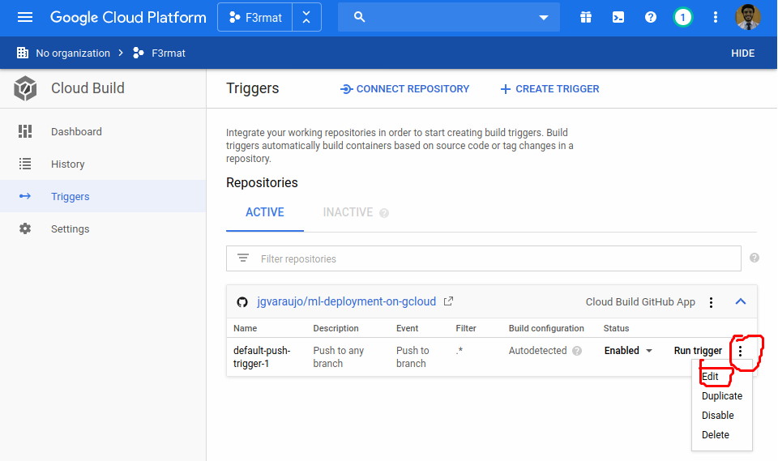

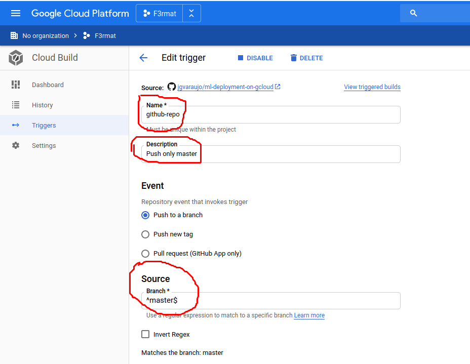

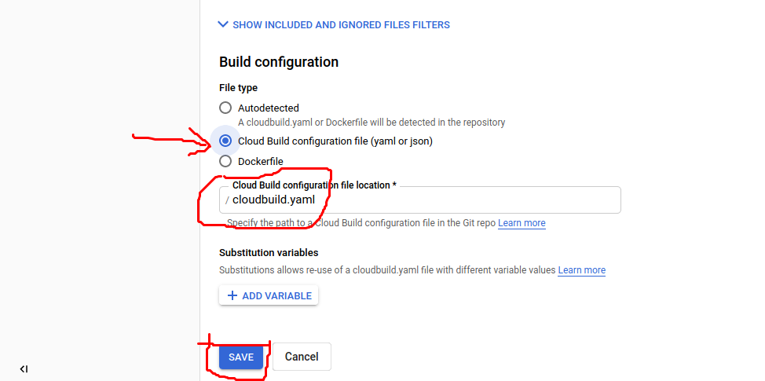

Now, with the trigger configured, all I have to do is execute a `git push`to my repository. The Google Cloud Build will read my `cloudbuild.yaml`and execute its steps.

## YAML Ain't a Markup Language - The `cloudbuild.yaml`

Google Cloud Build gives you two options:

- Build a Docker image with a Dockerfile;
- Use a [YAML](https://en.wikipedia.org/wiki/YAML) file to run commands from Google Container Registry images that builds your application;

The second option is more general. With this option I have lots of Cloud Builders [[4]]("#L4") to my disposal and I can run specific commands for my CI/CD purpose. This Cloud Builders are pre-built images to execute commands ([source codes](https://github.com/GoogleCloudPlatform/cloud-builders); [GCR list](https://console.cloud.google.com/gcr/images/cloud-builders/GLOBAL)).  However, for this project I just needed two of then:

- `docker`to invoke Docker commands;
- `gcloud` to invoke Google Cloud commands. This builder is responsible to call Google commands to deploy my application;

The YAML file `cloudbuild.yaml` is made of steps. I'll describe each one of the steps of this project.

### Step 1: Pull an existing container image if it is already built

This step will pull an existing image from the Google Container Registry. The `||`operator will execute `exit 0` if this pull command fails, i.e., it will not output any error message, so the building processes will not stop.

```yaml
steps:
  - name: 'gcr.io/cloud-builders/docker'
    entrypoint: 'bash'
    args:
      - '-c'
      - 'docker pull gcr.io/$PROJECT_ID/appcicd:latest || exit 0'
```

The environment variable `PROJECT_ID` doesn't need to be set.

### Step 2:  Build the new application image using the previous one

If the the first step didn't find an existing image, this command will create a new one, but if it did, this step will use the existing image as a cache in this build.

```yaml
steps:
  # <...>
  - name: 'gcr.io/cloud-builders/docker'
    args:
      - 'build'
      - '-t'
      - 'gcr.io/$PROJECT_ID/appcicd:latest'
      - '-t'
      - 'gcr.io/$PROJECT_ID/appcicd:$COMMIT_SHA'
      - '--cache-from'
      - 'gcr.io/$PROJECT_ID/appcicd:latest'
      - '.'
```

The name of my application image is `appcicd` and I set the tag `latest` for both cache and build image because I want to update my `latest`application. Also, I add a tag with the commit hash code, COMMIT_SHA, to possible rollback actions.

NOTE: I got this commands in an article of the Cloud Build documentation. The article shows the best practices for speeding up builds [[5]]("#L5").

### Step 3: Push the image to Google Cloud Registry

Simply as the title of this subsection, the command will push the new image of my application image to the GCR with both tags, `latest` and `$COMMIT_SHA`.

```yaml
steps:
  # <...>
  - name: 'gcr.io/cloud-builders/docker'
    args:
      - 'push'
      - 'gcr.io/$PROJECT_ID/appcicd'
```

### Step 4: Deploy the application in Google Cloud Run

```yaml
steps:
  # <...>
  - name: 'gcr.io/cloud-builders/gcloud'
    args:
      - 'run'
      - 'deploy'
      - 'appml'
      - '--image'
      - 'gcr.io/$PROJECT_ID/appcicd:latest'
      - '--region'
      - 'us-central1'
      - '--platform'
      - 'managed'
      - '--allow-unauthenticated'
```

The name of my application will be `appml`. This name will be displayed in the [Google Cloud Run API](https://console.cloud.google.com/run) where I'll get the URL to do the requests. The image used here will be the one that I built in this previous steps. I choose the  `us-central1`as [region](https://cloud.google.com/about/locations) and used the Google Cloud Run `managed` platform to scale up or down to zero my application.

**WARNING: In this project, for simplicity, I choose to `--allow-unauthenticated` requests. If you are just doing tests and serving the application for a few minutes, this option is not dangerous. Do not use this for production deployment.**

Advanced mode: if you want to change other default settings as the allowed concurrent requests; maximum number of instances; memory limit; request timeout; manage traffic; and so on, please go to the `gcloud run deploy` [documentation](https://cloud.google.com/sdk/gcloud/reference/run/deploy).

NOTE: I got this commands in an article of the Cloud Run documentation. The article shows how to do a CI/CD to Cloud Run [[6]]("#L6").

## Google Cloud Run

Now, I have the following elements:

- A Machine Learning model trained in Python and serialized within a Pickle;
- A Flask application that receives a JSON and runs my model predictions;
- A Dockerfile that builds the operating system image that will host my Flask application;
- A YAML file that have steps to build my Docker image and deploy it to the Google Cloud Run API;
- A trigger in the Google Cloud Build that listen my GitHub repository for changes and execute the YAML file configuration;

If I made a `git push` to my repository, in some seconds I'll see a new building process in the Google Cloud Build [History tab](https://console.cloud.google.com/cloud-build/builds) as in the figure below:

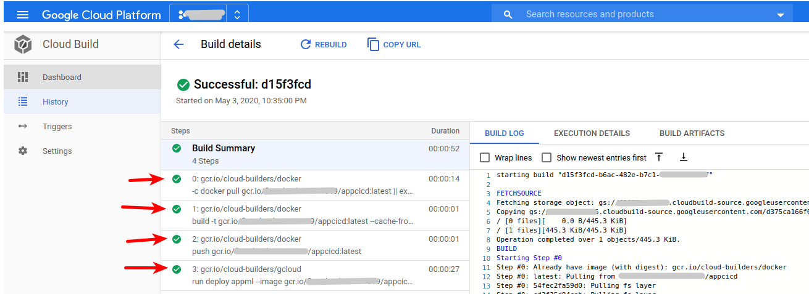

As you can see, it ran all of my YAML 4 steps with success and the build log is in the right side of the page.

After that, the Google Cloud Run will list my `appcicd` application and if I click on it I'll see some information about it. The main information here is the URL of my application, that's the address to make requests.

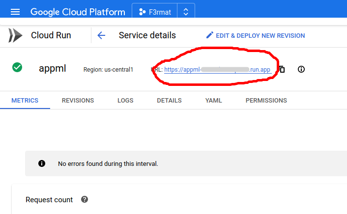

Now that the application is running, it's prepared to receive requests.

## Cloud request test

To test my application I used the same program describe in section "Request tests", but I choose a non-local application. Below, I put an example of the cloud request output. As you will see the response time is around 230ms-260ms, almost 60x-80x slower that my local application. The reason behind this slower behavior is because the host machine of my application is in Iowa (USA) and I'm living in São Paulo (Brazil), more than 8,700 km in a straight line.

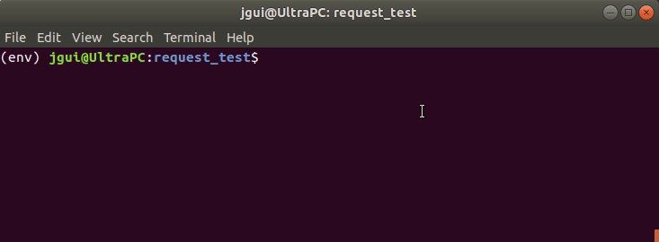

## Conclusion

As I said, this is a simple example on how to deploy your Machine Learning algorithm. Lots of names and technologies was said, but in the end, if you know Python, you just change names in some files and do some point and clicks to put your model into production.

The only point that was not addressed in this article was the request authentication to the Google Cloud Run service created. To do that please go to [Secure](https://cloud.google.com/run/docs/securing/managing-access) and [Authenticate](https://cloud.google.com/run/docs/authenticating/overview) sections in the Google Cloud Run documentation.

## References

<a name="L1">[1]</a> Todd Birchard, ["Building a Python App in Flask"](https://hackersandslackers.com/your-first-flask-application/). July, 2008. _(visited in April 20, 2020)_

<a name="L2">[2]</a> Yury Pitsishin, ["Docker RUN vs CMD vs ENTRYPOINT"](https://goinbigdata.com/docker-run-vs-cmd-vs-entrypoint/). April 2, 2016. _(visited in April 20, 2020)_

<a name="L3">[3]</a> Google Cloud Build Documentation, ["Build configuration overview"](https://cloud.google.com/cloud-build/docs/build-config). _(visited in May 3, 2020)_

<a Name="L4">[4]</a> Google Cloud Build Documentation, ["Cloud builders"](https://cloud.google.com/cloud-build/docs/cloud-builders). _(visited in May 3, 2020)_

<a Name="L5">[5]</a> Google Cloud Build Documentation, ["Best practices for speeding up builds"](https://cloud.google.com/cloud-build/docs/speeding-up-builds). _(visited in May 3, 2020)_

<a Name="L6">[6]</a> Google Cloud Run Documentation, ["Continuous deployment from git using Cloud Build"](https://cloud.google.com/run/docs/continuous-deployment-with-cloud-build). _(visited in May 3, 2020)_
